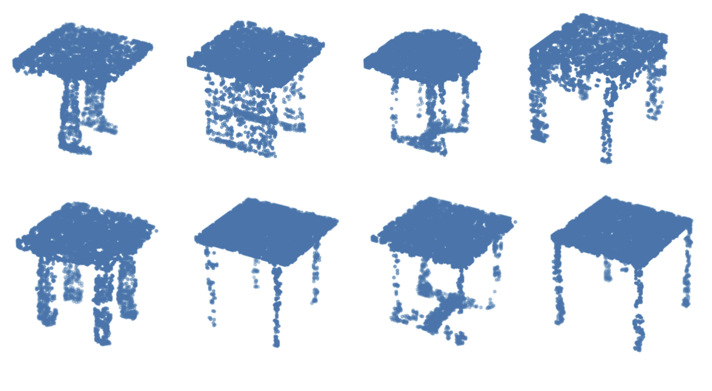

<div align=center>
  <h1>
    🪑 3D Volume Generation
  </h1>
  <p>
    <b>KAIST CS492(D): Diffusion Models and Their Applications (Fall 2024)</b><br>
    Course Project
  </p>
</div>

<div align=center>
   
   <figcaption>
	  3D shapes from the <a href="https://shapenet.org/" target="_blank">ShapeNet</a> dataset. The ShapeNet dataset is a large collection of 3D models spanning various object categories. In this project, we specifically focus on three categories: chairs, airplanes, and tables, which are among the most popular and vary in style and complexity. These 3D shapes are typically represented as 3D meshes but can be converted into various different formats: voxel grids or point clouds. We aim to build a diffusion model that generates 3D shapes represented by voxels.
    </figcaption>
</div>

---

## Description
This project explores 3D volume generation via diffusion models. We train a 3D diffusion model to sample volumetric data (voxels) at a resolution of (128, 128, 128) derived from the <a href="https://shapenet.org/" target="_blank">ShapeNet</a> dataset. Handling high-resolution voxel data is challenging in terms of GPU memory usage, and this project details how we mitigate these challenges through techniques such as 3D autoencoders (AE) and Latent Diffusion Models (LDM).

---

## Data Specification
We use three categories from the ShapeNet dataset: airplanes (2,658 shapes), chairs (1,958 shapes), and tables (3,835 shapes). Each shape is stored as a binary voxel grid (1 = occupied; 0 = empty).

To set up your environment and preprocess the data:

1. **Install the dependencies**:
   ```bash 
    pip install -r requirements.txt
    python load_data.py
   ```

__If the ShapeNet download link is not accessible or you encounter an error running `load_data.py`, please download the dataset on your local machine from [here](https://onedrive.live.com/?authkey=%21AFhw6N804-SPITU&id=0CE615B143FC4BDC%21188222&cid=0CE615B143FC4BDC) and send the file to your remote server. You have two options: either download `hdf5_data.zip`, the original ShapeNet dataset, and run `load_data.py` for pre-processing, or directly download `.npy` files. Note that downloading the `.npy` files may take longer.__ 

To send the file in your local machine to the remote server, you can refer to the following `rsync` command:
```
rsync -azP -e "ssh -i {PATH/TO/PRIVATE_KEY}" {PATH/TO/LOCAL_FILE} root@{KCLOUD_IP}:{PATH/TO/REMOTE/DESTINATION}
```

A 3D voxel visualization code is in `visualize.ipynb`.

<!-- ## Tasks
Your task is to implement diffusion models that sample 3D voxels of the three categories. You can implement either a single class-conditioned model that can sample all categories or a separate unconditional model for each category. You can even convert the provided voxel data into any format, such as meshes or point clouds so that the network takes the converted 3D data as input. 

__The only implementation requirement is that the final output of the model must be 3D voxels, i.e., the output of your network should be voxels only, not other representations, such as point clouds or meshes, that require post-processing to be converted into voxels.__

After implementing the model, run the evaluaiton code provided and report the results. Below are further details on the evaluation. -->

## Method
In this section, we describe the methods used to train our diffusion model and the architectural choices that led to our final 3D generation system.

### 3D AutoEncoder (AE)
Since the voxel data is large, an autoencoder helps reduce computational requirements by mapping the voxel grids to a latent space before applying diffusion. Our autoencoder uses 3D convolutional layers to preserve spatial information. Data enters as (B, 1, 64, 64, 64):

#### 1. Encoder
Converts (B, 1, 64, 64, 64) to latent (B, 16, 8, 8, 8) using 3D Conv, BatchNorm3D, and LeakyReLU layers.
#### 2. Decoder
Reconstructs (B, 1, 64, 64, 64) from (B, 16, 8, 8, 8) through a symmetric set of 3D Conv, BatchNorm3D, and activation layers.

We use a sigmoid output layer and Binary Cross-Entropy (BCE) loss because voxel data is binary.

Interestingly, we trained a single AE for all three categories (airplanes, chairs, and tables) instead of separate AEs, achieving good performance across all of them.

## 3D Latent Diffusion Model (LDM)
After the data is compressed into its latent representation, our diffusion model (DDPM-based) operates in the latent space:

### UNet3D:
We adapt a 2D UNet for 3D by changing all 2D Conv/Attention layers to 3D counterparts.
The input is Gaussian noise in the latent shape (B, 16, 8, 8, 8), and the model learns to denoise it step by step.
### Classifier-Free Guidance (CFG):
For class conditioning, we use CFG so the model can generate data for specific categories.
We incorporate the category label information during training and inference.

### Training Details:
We used a batch size of 64 for AE and 16 for LDM.
Learning rates: lr=0.001 for AE, lr=2e-4 for LDM.
We set the total training epochs to 1000; best results were observed around 600–650 epochs.

## Score Distillation Sampling (SDS)
We initially experimented with Score Distillation Sampling to further refine generation. While it improved individual sample quality, it tended to reduce overall diversity (producing similar-looking shapes for a given class). Thus, we ultimately decided against using SDS in our final model.


## Evaluation
We evaluate our 3D generation in terms of Jensen-Shannon Divergence (JSD), Minimum Matching Distance (MMD), and Coverage (COV), following Achlioptas et al. [1].

### JSD:
* Treats voxel sets as probability distributions.
* Measures divergence between generated samples and reference data.
### MMD & COV:
* For each generated voxel grid, we find its nearest neighbor in the reference set.
* COV quantifies how many of the reference data points are “covered” by the generated set.
* MMD measures fidelity by calculating the distance to the reference data’s nearest neighbors.

To measure these, sample 1,000 voxels per category and save them as (1000, 128, 128, 128) in .npy format. Threshold them at 0.5 (values > 0.5 become 1, else 0). Then, run:
```bash
python eval.py {CATEGORY} {PATH/TO/YOUR_SAMPLE_DATA.NPY}
```

## Results
We trained our model on the three categories and measured JSD, MMD, and COV. Below are the final metrics:

| Category | JSD | MMD | COV |
|:------------------:|:-----------------:|:-----------------:|:-----------------:|
| Table| 0.0879 | 0.0054 | 0.2047 |
| Airplane | 0.0672 | 0.0023 | 0.3688 |
| Chair | 0.0847 | 0.0056 | 0.2690 |

### Sample Visualizations
#### Table


#### Airplane


#### Chair


## Implementation Details
1. Environment Setup

```bash
conda env create -f environment.yml
conda activate 3d_volume
```

<!-- Make sure to set the dataset directory path inside each training script as needed. -->

2. Training the AutoEncoder

File: autoencoder.py
Run:
```bash
python autoencoder.py --dataset_path {PATH/TO/DATASET} --ckpt_path {PLACE/TO/PUT/CKPT}
```
<!-- Edit paths for dataset loading/saving as necessary. -->
3. Training the Latent Diffusion Model

File: train_n.py (located in the diffusion folder)
Example:
```bash
python train_n.py --use_cfg --dataset_path {PATH/TO/DATASET} --ae_ckpt_path {PATH/TO/AE/CKPT}
```
Make sure to load your AE checkpoints, set parameters, and specify the dataset path.

4. Sampling

File: sampling_n.py (in diffusion folder)
Example:
```bash
python sampling_n.py --ldm_ckpt_path {PATH/TO/DIFFUSION/CKPT} --ae_ckpt_path {PATH/TO/AE/CKPT} --save_dir {PATH/TO/SAVE_DIR} --use_cfg
```
Loads the trained model and generates samples in latent space before decoding them to voxels.

5. (Optional) Score Distillation Sampling

File: main.py (in sds folder)
Run:
```bash
python main.py --ldm_ckpt_path {PATH/TO/DIFFUSION/CKPT} --ae_ckpt_path {PATH/TO/AE/CKPT}
```
The SDS code is in sds_code folder. It currently handles one class at a time by manually changing the class label in model.py (line 43).
Thresholding & Visualization

After sampling, you can manually set thresholds and visualize results in visualization.ipynb.

## Acknowledgements
* Amin Jafarzade: Implemented the Latent Diffusion Model.
* Toghrul Abbasov: Implemented the Autoencoder and initial SDS.
* Experimentation, training, result evaluation, and analysis were collaborative efforts.

<!-- ## Evaluation
To assess the quality and diversity of the generated samples, we follow Achlioptas et al. [1] and use Jensen-Shannon Divergence (JSD), Minimum Matching Distance (MMD), and Coverage (COV). 

JSD treats voxel sets as probability distributions over the 3D space, where each voxel grid represents the likelihood of being occupied. It then measures the Jensen-Shannon Divergence between the two input voxel sets, providing a similarity measure from the probabilistic perspective. In MMD and COV, we first compute the nearest neighbor in the reference set for each voxel in the sample set. COV evaluates the diversity of the samples by measuring how many voxels in the reference set are covered by the nearest neighbors from the sample set. On the other hand, MMD assesses the fidelity of the samples by calculating the distance between each voxel in the sample set and its corresponding nearest neighbor in the reference set.

__*For each category*__, sample 1,000 voxels using your model and save them in `.npy` format with a shape of `(1000, 128, 128, 128)`. At the end of the sampling process, discretize the values to either 0 or 1 by applying a threshold, setting the value to 1 if x > 0.5 and to 0 otherwise. Once the data is saved, run the following command to measure JSD, MMD, and COV:

```
python eval.py {CATEGORY} {PATH/TO/YOUR_SAMPLE_DATA.NPY}
```
, where `CATEGORY` is one of `chair`, `airplane`, or `table`.

Note that the evaluation script may take around 30 minutes to complete. -->


<!-- ## What to Submit
In a single PDF file, report screenshots of your __quantitative scores (JSD, MMD, and COV)__ along with at least 8 visualization of your samples __for each category__.
Compress your source code and the pdf file into a zip file and submit it.

## Acknowledgement mlb7TIotMd+2Pg==
The dataset is from <a href=https://shapenet.org/ target="_blank">ShapeNet</a>.
-->
## Reference
[1] [Learning Representations and Generative Models for 3D Point Clouds](https://arxiv.org/abs/1707.02392)
